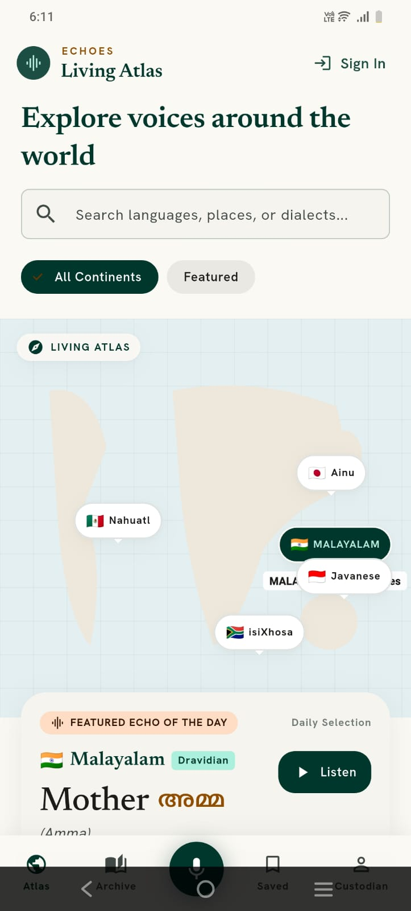
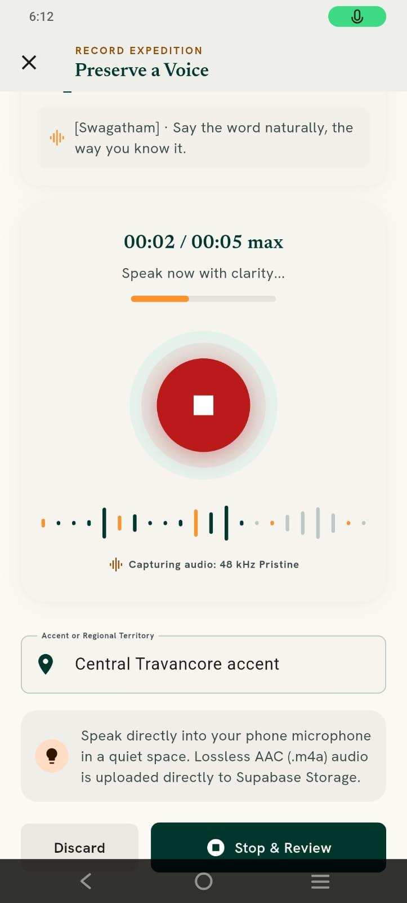
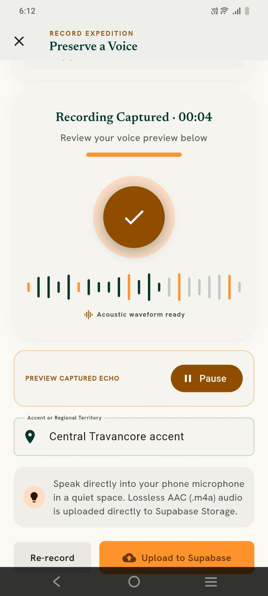

# Echoes: A Living Sound Map

A mobile app that preserves endangered languages through a crowdsourced sound map.
Listen, Record, Pin.

Built for HackDay 1.0 by Team DECODEP.

## The Problem

About 40% of the world's ~7,000 languages are endangered. When a language dies, its stories, oral traditions, and place names vanish with it. Existing archives are mostly academic and hard for everyday people to access.

## Our Solution

Echoes is a living audio archive. Users explore a world map of language pins, listen to real voices, and record their own words to keep their language alive for future generations.

## Features

- **Living Atlas:** an interactive map of language pins (Nahuatl, Ainu, Malayalam, Javanese, isiXhosa and more), with search and continent filters
- **Echo of the Day:** a featured word with native script, transliteration, and audio playback
- **Daily Acoustic Tapestry:** a daily featured recording
- **Preserved Dialects:** browse languages with voice counts
- **Record Expedition:** record a clip of up to 5 seconds, tag your accent or regional territory, preview it, re-record, and upload
- **Authentication:** sign in or join as a Custodian, or continue as a Guest Explorer
- **Saved and Archive tabs** for collecting and browsing recordings

## Tech Stack

| Layer | Technology |
|---|---|
| Frontend | Flutter (Dart) |
| Architecture | MVVM |
| State management | Cubit (flutter_bloc) |
| Backend | Supabase (Auth with Row-Level Security, Database, Storage) |
| Audio | AAC (.m4a) recording and playback |

## Folder Structure (MVVM)

```
lib/
├── main.dart
├── core/          # theme, constants, utils, Supabase config
├── data/          # models, repositories, services
├── view_model/    # Cubits and states
└── view/          # screens and widgets
```

## Getting Started

**Prerequisites:** Flutter SDK, a Supabase project, and an Android or iOS device/emulator.

```bash
git clone https://github.com/alfridi/echoes-flutter.git
cd echoes-flutter
flutter pub get
```

Add your Supabase URL and anon key (never commit real keys):

```bash
flutter run --dart-define=SUPABASE_URL=your_url --dart-define=SUPABASE_ANON_KEY=your_anon_key
```

## Screenshots

| Living Atlas | Recording | Review and Upload |
|---|---|---|
|  |  |  |

## Roadmap

- Community reporting and moderation tools
- Shareable badges and community challenges
- Offline regional language packs
- Native-speaker verification badges
- Learning mode (quizzes and flashcards)
- 3D globe view and partnerships with linguists and indigenous communities

## Team

Team DECODEP, HackDay 1.0
